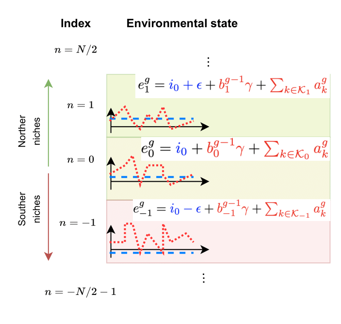
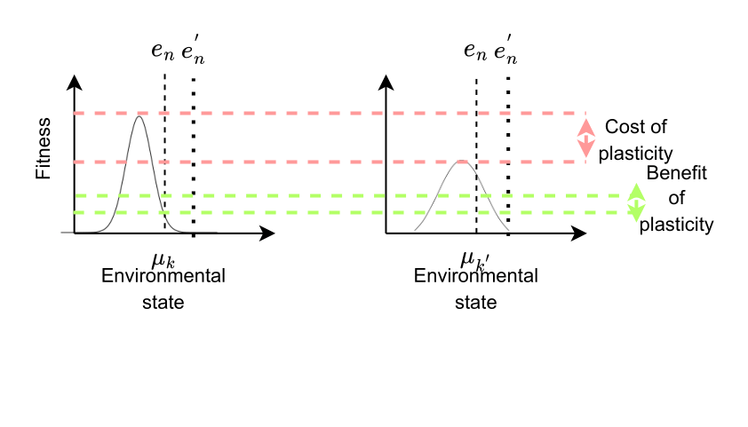
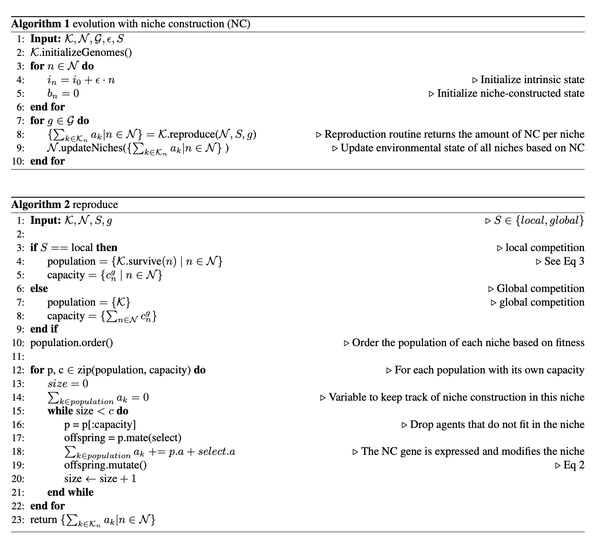

# Dynamics of niche construction in adaptable populations evolving in diverse environments

This is the code accompannying our paper *Dynamics of niche construction in adaptable populations evolving in diverse environments* appearing in the ALife 2023 conference.

In this work we have studied the evolution of niche construction in a population of agents that can adapt its plasticity and evolvability in a world divided in niches that differ in their quality.
 

Each niche $n$ is characterized by its environmental state $e_n^g$ which is the sum of the intrinsic state $i_n$ (in blue) and the niche-constructed state $a_n^g$ (in red). The intrinsic state remains constant with time and is determined by the state of the reference niche $(e_0)$ and the offset $\epsilon$. The niche-constructed state is the sum of the niche-constructing behavior of agents that reproduce in this niche in the current generation and the niche-constructed state at the previous generation discounted by $\gamma$. It therefore, varies with time.



We model the plasticity of an individual using tolerance curves  originally developed in ecology. Plasticity curves have the form of a Gaussian the capture the benefits and costs of plasticity when comparing a specialist (left) with a generalist (right) agent:




The following two algorithms present the pseudocode of the evolutionary algorithm in this paper. $\mathcal{K}$ denotes the set of agents, $\mathcal{N}$ the set of niches, $\mathcal{G}$ the generations, $\epsilon$ is the offset in intrinsic state between niches and $S$ denotes the selection mechanism.




# How to use

The repo contains the following main elements :

* folder source contains the main functionality for running a simulation
* folder scripts contains scripts for reproducing the experiments and figures

To reproduce the figures without rerunning the experiments, you can download all data from [this drive](https://share.internxt.com/d/sh/folder/91dfa3b1aab9c1c540ec/c389174f8bb8fd0a0316dbc42448ea8b41e0d5162100991ba87b861a99463c26) and unzip them under a directory *projects*.

To install all package dependencies you can create a conda environment as:

`conda env create -f environment.yml`

All script executions need to be run from folder source. Once there, you can use simulate.py, the main interface of the codebase to run a simulation, For example:

`python simulate.py --project test --num_gens 300 --capacity 1000 --num_niches 100 --trials 10 --selection_type NF --climate_mean_init 0.6`

will run a simulation with an environment where the reference intrinsic state is 0.6 and there are 100 niches for 300 generations and 10 independent trials. The maximum population size will be 1000 and selection will be done under local competition

# To cite this work

```
@article{Nisioti2023Dynamics,
	title={Dynamics of niche construction in adaptable populations evolving in diverse environments},
	author={Nisioti, Eleni and Moulin-frier, Clément},
	journal={ALife},
	year={2023}
}
```


